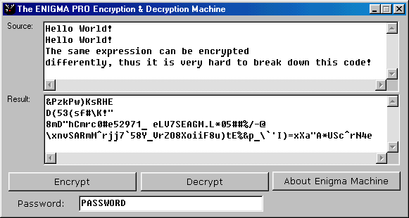



## Encrypt &amp; Decrypt

### Description

It encrypts and decrypts any piece of information you type!
 
### More Info
 
---Very Important---

Include the module (.bas file) in the form before running.

             |
---                |---
**Submitted On**   |2008-10-24 09:00:02
**By**             |[Biswarup Bhattacharya](https://github.com/Planet-Source-Code/PSCIndex/blob/master/ByAuthor/biswarup-bhattacharya.md)
**Level**          |Advanced
**User Rating**    |5.0 (10 globes from 2 users)
**Compatibility**  |VB 5\.0, VB 6\.0
**Category**       |[Encryption](https://github.com/Planet-Source-Code/PSCIndex/blob/master/ByCategory/encryption__1-48.md)
**World**          |[Visual Basic](https://github.com/Planet-Source-Code/PSCIndex/blob/master/ByWorld/visual-basic.md)
**Archive File**   |[Encrypt\_&\_21317810242008\.zip](https://github.com/Planet-Source-Code/biswarup-bhattacharya-encrypt-amp-decrypt__1-71285/archive/master.zip)

